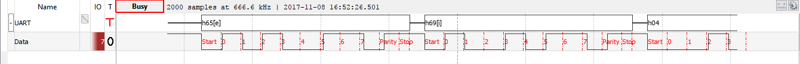

# Modulacao Digital
#### Eduardo Tirta, Gulherme Graicer
### Protocolo Uart
O protocolo tem um estado inicial de sinal 1, constante, para enviar um dado, ele envia um bit start de sinal 0, para indicar ao receptor que uma mensagem será enviada, então, logo após, envia o payload, que sao uma sequência de bits que formam um caracter, de acordo com a tabela ASCII, depois do envio do payload, um bit de paridade eh enviado para poder identificar algum erro que pode ter ocorrido no processo de envio, deixando a informacao mais precisa e com menos erros, finalmente, um stop bit de sinal 1 eh enviado, o que faz retornar ao modo inicial

### Onda

### Descricao do codigo

#### Transmissor

  Primeiramente, calcula-se a paridade do payload a ser enviado somando cada bit dele. Como foi definido que a paridade será ímpar, se a soma der um número par o bit de paridade será 1, caso contrário, ele será 0. Após isso, é enviado o start bit (0) e espera-se o um tempo (equivalente a 2 comandos NOP em assembly). Em seguida ocorre o envio do payload. Como isso ocorre? Para separar o 1o bit, basta fazer um AND do byte a ser enviado com um 0x01. Para separar o 2o, faz-se um shift para direita dos bits do byte a ser enviado e então faz-se o AND com um 0x01. Parra o 3o usa-se 2 shifts para a direita e assim por diante. Após isso, envia-se o bit de paridade e o stop bit (definido como um 1). Por fim a conexão é deixada em alta (1).

#### Receptor
  Para receber um pacote, inicia com a espera de um bit start de sinal 0, como indicado no protocolo UART, ao receber o start bit inicia a recepção dos bits, para cada caracter, sao recebidos 8 bits, que ao fazer a leitura do pino, faz um shift para esquerda, e faz um or com os dados recebidos anteriores, no fim de 8 dados recebidos, e feito o precosso anterior, forma um byte que se torna um caractér. Ao receber todo o dado, recebe o stopbit de valor 1 e para encerrar o recebimento. A paridade é feita para verificar se os dados receberam sem nenhum problema, nenhuma perda durante o envio.
