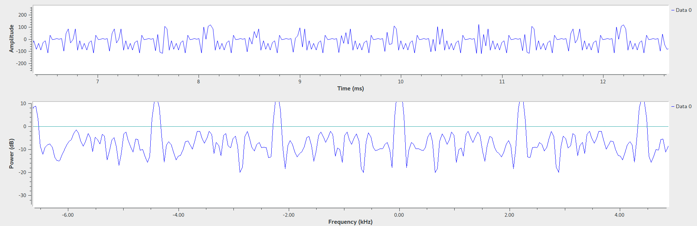
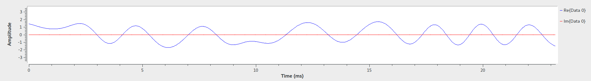
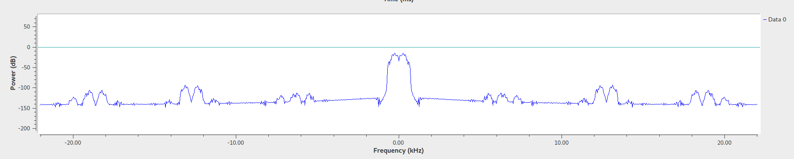
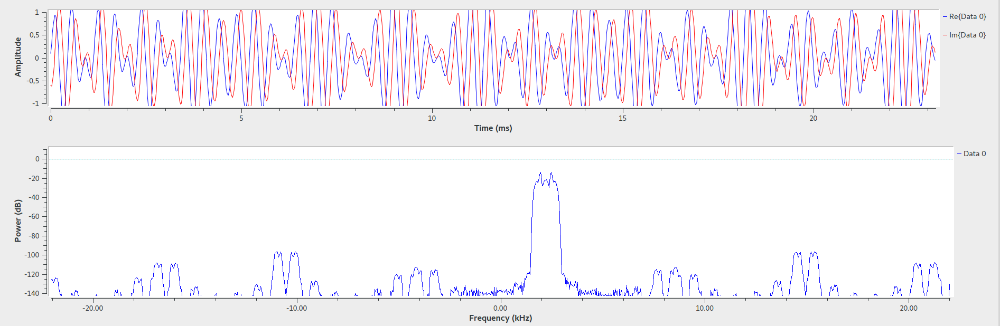
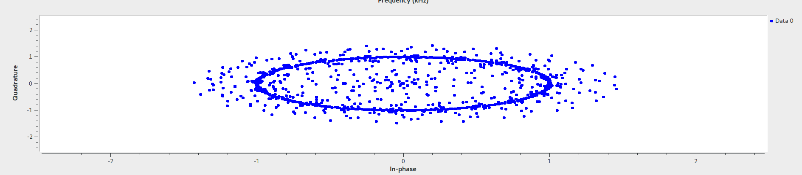
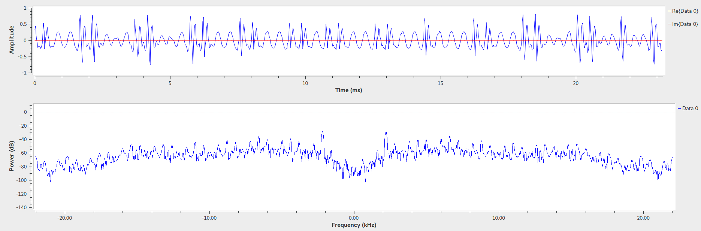
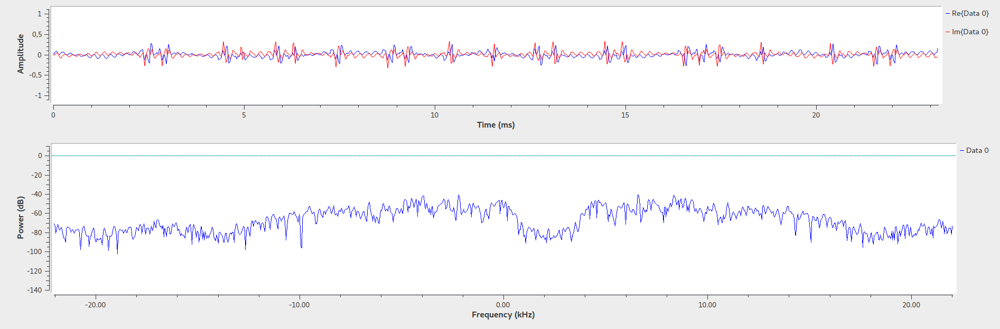
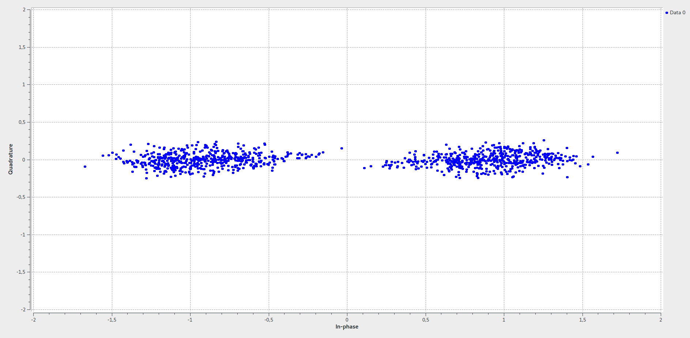

# Modulação/Demodulação BPSK

## Frequência de transmissão e Banda ocupada

A frequencia escolhida foi 2200 Hz, depois de varios testes, pois essa foi a que deu melhores resultados.
A banda ocupada é de: 4400

## Funcionamento geral
(camada 1 - aplicação - python)

uma mensagem é escrita --> ela é transformada em um sinal digital (bytes) --> em seguida, ela é mandada para o GNU via socket TCP/IP

(camada 2 - física - GNU)

o GNU modula o sinal de áudio em BPSK- --> transmite por áudio

(camada 3 - meio - som)

transmite por audio em um speaker de um pc --> recebe o audio pelo microfone de outro pc

(camada 2 - física - GNU)

o GNU demodula o sinal de áudio --> manda para a apicação via socket TCP/IP

(camada 1 - aplicação - python)

recebe o audio demodulado --> transforma em uma string --> imprime na tela

## Modulação em BPSK

Esse tipo de modulaço em fase usa duas fases longe 180 graus uma da outra. Uma fase é usada para o 0 e outra para o 1.

## GNU Radio

### TX

#### gráfico no tempo e em frequência do sinal não codificado

#### gráfico no tempo e em frequência do sinal codificado (após o constellation modulator)

#### gráfico no tempo e em frequência do sinal modulado

#### diagrama de constelação

### RX

####  sinal de áudio recebido no tempo e em frequência

#### sinal de áudio demodulado no tempo e em frequência

#### diagrama de constelação

